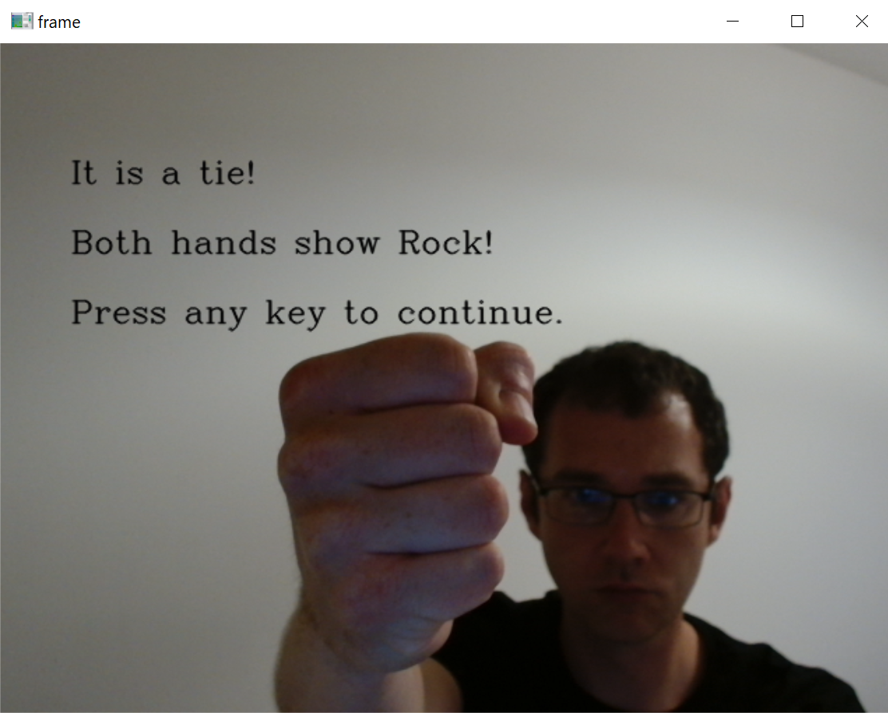

# Computer Vision RPS

# Milestone 1
Git Hub repository created for the Rock-Paper_Scissors game. The files created are:
- README.md
- RPS-Template.py #not yet explained/understood

# Milestone 2
Project will use the teachable machine deep learing model from Google. The model will collect data from the video camera and, when trained, detect the shown hand.
Class for each option (rock, paper, scissors or nothing) has been created and camera images collected. The number of images for each hand exceeds 100 and includes images of hands up close
and further away.
Model trained, files keras_model.h5 and labels.txt downloaded.

# Milestone 3
This part of the project has been aimed to install all the required dependencies and check that the model trained in the previous milestone works as expected.
The libraries installed include:
- opencv-python
- tensorflow # there are issues when running this on a older computers
- ipykernel

The file requirements.txt contains all the required libraries. These can be installed by running the following command:
pip install requirements.txt

File RPS-Template.py is used to run the model with the use of the camera. Output is displayed in a NumPy array format, example:
[[0.8, 0.1, 0.05, 0.05]]
Each number from the array corresponds to a probability (between 0 and 1) that an input image shows: rock, paper, scissors or nothing respectively.

# Conclusion
The model responds to changes in image input. It is challenging to track if the predicions are correct looking at the output to the terminal. The numbers are changing, but they are displayed in a format that is 
difficult to interpret at first. This model needs to be combined with code that will help make it more clear.

# Milestone 4
The game logic is created in manual_rps.py. This file does not make use of the pre-trained deep learning model, only manual input.
Functions created include:

get_computer_choice() - uses Python's random module to choose the computer's hand

get_user_choice() - asks the user to input their choice and validates it

get_winner() - takes two required arguments; computer choice and user choice, compares the hands and announces the winner (or a tie)

play() - this function encapsulates all the ones described above to simplify game initiation

# Conclusion
Game works correctly with manual input. What remains is to connect it with the deep learning model.

# Milestone 5
The game has been integrated with the model in file camera_rps.py and finished.

Fuctionality added:

- The game works only if the file is ran directly:

    if __name__ == "__main__":  

- All functions are now methods of the RockPaperScissors class.

- The number of rounds to play defaults to 3, but can be passed when creating an instance of the game class:

    five_round_rps = RockPaperScissors(5)

- The countdown() method displays numbers from 5 to 1 in the camera view and then announces the round number.

  With the use of the time module it is possible to start recording time and calculate the total time elapsed:

'''

    start = time.time()

    total = time.time() - start

'''
  Each number is displayed to the camera view for a duration of one second. Example for number 3:

  

'''

    elif total > 2 and total < 3:
        cv2.putText(frame,"3", org, font, fontScale, fontColor, thickness, lineType)
        cv2.imshow("frame",frame)
        cv2.waitKey(1)

'''
  If the time elapsed is more than 5 seconds (countdown reaches 0) then number of the round is displayed in the camera view and printed to the terminal.
  
  This part also includes a "break" statement to stop the infinite While loop:
'''

    elif total > 5:
        print(f"Round {self.rounds_played + 1}!")
        org = (50, 100)
        cv2.putText(frame,f"Round {self.rounds_played + 1}!", org, font, fontScale, fontColor, thickness, lineType)
        cv2.imshow("frame",frame)
        cv2.waitKey(500)
        break  

'''
  Here the delay is set to 500 miliseconds to allow the player to see the round number.

- The get_prediction() method now also returns the final frame captured from the camera when the prediction is made.

- The play() method uses all game functionality to initiate gameplay. Game ends eiher if the number of wins of either the player or computer reaches 3 or number of rounds played reaches the defined number:
'''

    while user_wins < 3 and computer_wins < 3 and self.rounds_played < self.rounds:
        self.countdown()
        results = self.get_prediction()
        user_choice_prediction = results[0]
        computer_choice = self.get_computer_choice()
        winner = self.get_winner(computer_choice, user_choice_prediction)
        last_frame_recorded = results[1]

'''  
  "results[0]" is the class name returned from get_prediction() ("Rock", "Paper", "Scissors" or "Nothing").

  "results[1]" is the last recorded frame returned from get_prediction().

  The program checks who won the round and announces the winner both in the terminal and camera view. It also recognizes ties, for example:

    

'''

    cv2.putText(last_frame_recorded,"It is a tie!", org, font, fontScale, fontColor, thickness, lineType)
    cv2.putText(last_frame_recorded,f"Both hands show {user_choice_prediction}!", (50, 150), font, fontScale, fontColor, thickness, lineType)
    cv2.putText(last_frame_recorded,"Press any key to continue.", (50, 200), font, fontScale, fontColor, thickness, lineType)
    cv2.imshow("frame",last_frame_recorded)
    cv2.waitKey(0)
    self.rounds_played += 1

'''

  To improve user experience the game stops until a key is pressed. 

  Each outcome results in a incrementation of wins for the winner (if not a tie) and number of played rounds.

  Finally the winner of the whole game (if any) is announced to the camera image. In case there is no winner, the breakdown of wins is printed to the terminal:

'''

    elif self.rounds_played == self.rounds:
        print(f"You have reached {self.rounds} rounds wihout a winner!")
        print(f"You won {user_wins} games. \nComputer won {computer_wins} games.")
        ret, frame = cap.read()
        cv2.putText(frame,f"No winner in {self.rounds} rounds !", org, font, fontScale, fontColor, thickness, lineType)
        cv2.putText(frame,"Press any key to exit.", (50, 150), font, fontScale, fontColor, thickness, lineType)
        cv2.imshow("frame",frame)
        cv2.waitKey(0)

'''

# Conclusion
The game works as expected in most scenarios. However, there are issues with getting incorrect predictions from the get_prediction() method.
This is most likely due to the model not being trained well enough. After several training attempts the issue still remains. 
The countdown and other messages sent to the camera view are very useful and improve the game experience. 
Further improvements could include a welcome screen and an option to repeat the game when it has finished.
